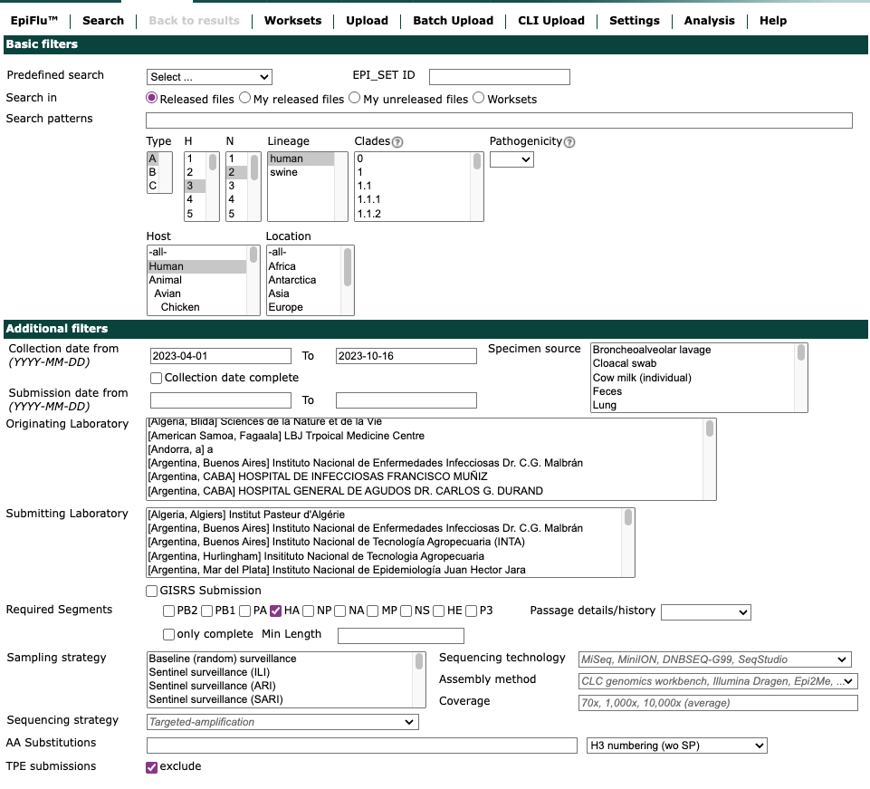
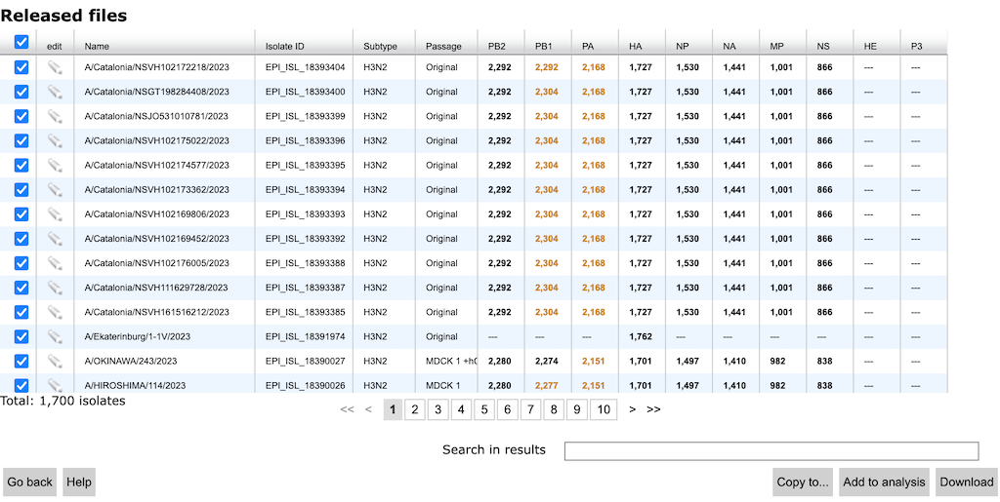
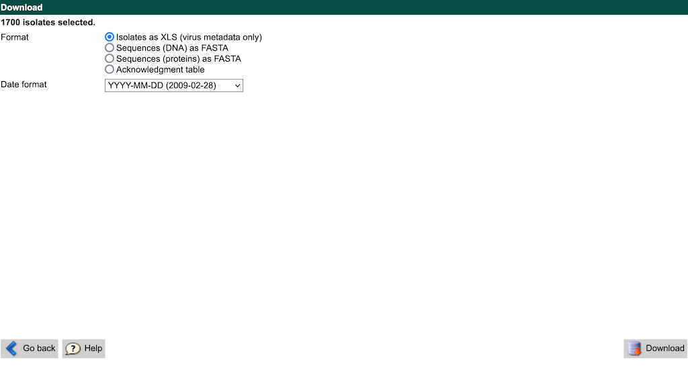
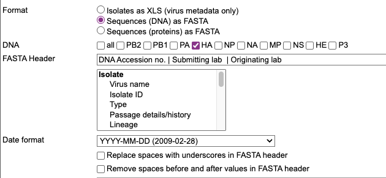

# nextstrain.org/flu

[](https://github.com/nextstrain/seasonal-flu/actions/workflows/ci.yaml)

This is the [Nextstrain](https://nextstrain.org) build for seasonal influenza viruses,
available online at [nextstrain.org/flu](https://nextstrain.org/flu).

The build encompasses fetching data, preparing it for analysis, doing quality control,
performing analyses, and saving the results in a format suitable for visualization (with
[auspice][]).  This involves running components of Nextstrain such as [fauna][] and
[augur][].

All influenza virus specific steps and functionality for the Nextstrain pipeline should be
housed in this repository.

This build is more complicated than other standard nextstrain build because all four
currently circulating seasonal influenza lineages (A/H3N2, A/H1N1pdm, B/Vic and B/Yam)
are analyzed using the same Snakefile with appropriate wildcards. In addition, we run
analyses of both the HA and NA segments of the influenza virus genome and analyze datasets
that span different time intervals (eg 2, 3, 6 years). Furthermore, the Nextstrain analysis
of influenza virus evolution also uses antigenic and serological data from different
WHO collaborating centers.

The different builds for the general public and the different WHO collaborating centers
are configured via separate config files. The Nextstrain build configs
([upload](profiles/upload.yaml), [nextstrain-public](profiles/nextstrain-public.yaml), [private.nextflu.org](profiles/private.nextflu.org.yaml))
are used for our semi-automated builds through our [GitHub Action workflows](.github/workflows/).

## Example build

You can run an example build using the example data provided in this repository.

First follow the [standard installation instructions](https://docs.nextstrain.org/en/latest/install.html)
for Nextstrain's suite of software tools.

Then run the example build via:

```
nextstrain build .  --configfile profiles/example/builds.yaml
```

When the build has finished running, view the output Auspice trees via:

```
nextstrain view auspice/
```

## Quickstart with GISAID data

Navigate to [GISAID](http://gisaid.org).
Select the "EpiFlu" link in the top navigation bar and then select "Search" from the EpiFlu navigation bar.
From the search interface, select A/H3N2 human samples collected in the last six months, as shown in the example below.



Also, under the "Required Segments" section at the bottom of the page, select "HA".
Then select the "Search" button.
Select the checkbox in the top-left corner of the search results (the same row with the column headings), to select all matching records as shown below.



Select the "Download" button.
From the "Download" window that appears, select "Isolates as XLS (virus metadata only)" and then select the "Download" button.



Create a new directory for these data in the `seasonal-flu` working directory.

``` bash
mkdir -p data/h3n2/
```

Save the XLS file you downloaded (e.g., `gisaid_epiflu_isolates.xls`) as `data/h3n2/metadata.xls`.
Return to the GISAID "Download" window, and select "Sequences (DNA) as FASTA".
In the "DNA" section, select the checkbox for "HA".
In the "FASTA Header" section, enter only `Isolate name`.
Uncheck both boxes related to spaces in the FASTA header.
Your settings should look like those shown in the screenshot below.



Select the "Download" button.
Save the FASTA file you downloaded (e.g., `gisaid_epiflu_sequences.fasta`) as `data/h3n2/raw_sequences_ha.fasta`.

Run the Nextstrain workflow for these data to produce an annotated phylogenetic tree of recent A/H3N2 HA data with the following command.

``` bash
nextstrain build . --configfile profiles/gisaid/builds.yaml
```

When the workflow finishes running, visualize the resulting tree with the following command.

``` bash
nextstrain view auspice
```

Explore the configuration file for this workflow by opening `profiles/gisaid/builds.yaml` in your favorite text editor.
This configuration file determines how the workflow runs, including how samples get selected for the tree.
Try changing the number of maximum sequences retained from subsampling from `100` to `500` and the geographic grouping from `region` to `country`.
Rerun your analysis by adding the `--forceall` flag to the end of the `nextstrain build` command you ran above.
How did those changes to the configuration file change the tree?

To skip subsampling and use all records that you downloaded from GISAID, set `filters` string in the build configuration file to an empty string as shown in the following subsection of the YAML file.

```yaml
      subsamples:
        global:
            filters: ""
```

Explore the other configuration files in `profiles/`, to see other examples of how you can build your own Nextstrain workflows for influenza.

> [!IMPORTANT]
> The workflow is optimized for HA and NA segments and requires additional files if you are building other segments!

- The following files are required for different lineage and segment builds:
  - reference: "config/{lineage}/{segment}/reference.fasta"
  - annotation: "config/{lineage}/{segment}/genemap.gff"
  - tree_exclude_sites: "config/{lineage}/{segment}/exclude-sites.txt"
- The workflow assigns clade annotations to non-HA segments from HA, so the
`clades` configuration should always point to the HA clade definition TSV.
- The workflow only has subclade annotations for HA and NA segments, so remove
the `subclades` configuration for other segments builds.

## History

 - Prior to March 31, 2023, we selected strains for each build using a custom Python script called [select_strains.py](https://github.com/nextstrain/seasonal-flu/blob/64b5204d23c0b95e4b06f943e4efb8db005759c0/scripts/select_strains.py). With the merge of [the refactored workflow](https://github.com/nextstrain/seasonal-flu/pull/76), we have since used a configuration file to define the `augur filter` query logic we want for strain selection per build.

[Nextstrain]: https://nextstrain.org
[fauna]: https://github.com/nextstrain/fauna
[augur]: https://github.com/nextstrain/augur
[auspice]: https://github.com/nextstrain/auspice
[snakemake cli]: https://snakemake.readthedocs.io/en/stable/executable.html#all-options
[nextstrain-cli]: https://github.com/nextstrain/cli
[nextstrain-cli README]: https://github.com/nextstrain/cli/blob/master/README.md
