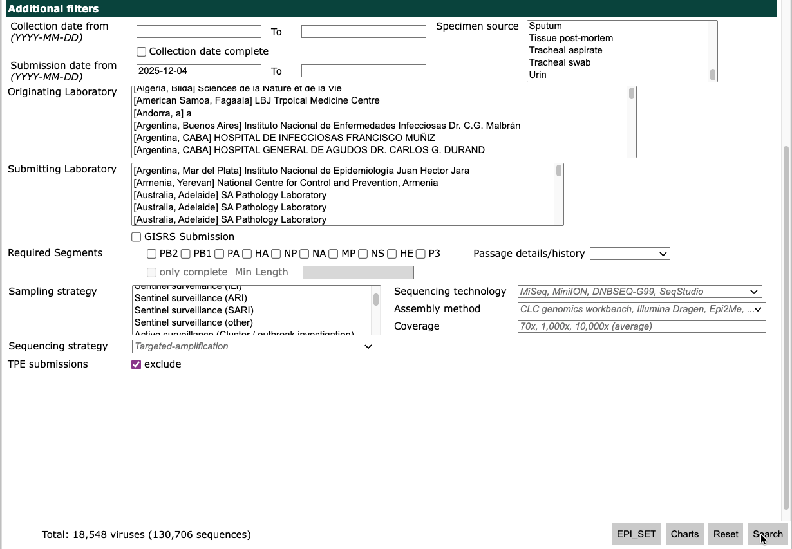
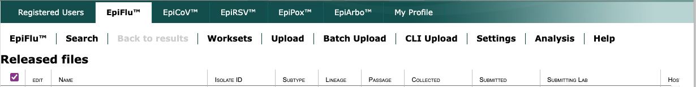
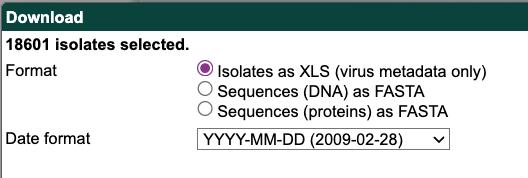
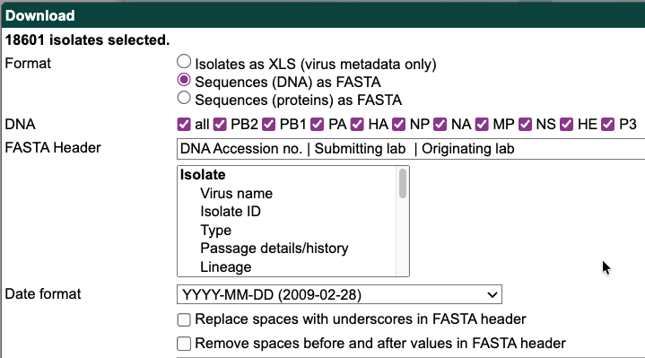

# Nextstrain manual upload

> [!NOTE]
> External users can ignore this directory!
> This build is tailored for the internal Nextstrain team to
> run manually to upload GISAID files to our private AWS S3 bucket.

This workflow uploads files which have been manually downloaded from GISAID to S3, storing them as "unprocessed" pairs of files.

## Download from GISAID

1. Log in to [GISAID](https://www.gisaid.org).
2. Navigate to the “EpiFlu” tab.
3. Skip the “Basic filters” and go to “Additional filters”.
    - Select a “Submission date” from 2 months before the current date.
    - Exclude TPE submissions.
    - If the total number of viruses exceeds your download limit, split into
      multiple downloads with rolling window of submission dates,
      e.g. 2025-11-06 to 2025-12-04 and 2025-12-04 to “blank”.
    
4. Click "Search" to see filtered records.
5. Select all records by clicking the box in the upper left corner of the table and click “Download”.
    
6. In the download modal, select “Isolates as XLS”, set the “Date format” to “YYYY-MM-DD” and click “Download”.
    
7. Save the downloaded Excel file as `<YYYY-MM-DD-N>-metadata.xls`.
    - `<YYYY-MM-DD>` is the date the files were downloaded from GISAID.
    - `<N>` is the number of the download since GISAID limits the number of records per download.
    - For example, if you had to split the data between two downloads on 2025-04-11,
      then save the files as
        - `2025-04-11-01-metadata.xls`
        - `2025-04-11-01-sequences.fasta`
        - `2025-04-11-02-metadata.xls`
        - `2025-04-11-02-sequences.fasta`

8. Click “Download” to bring up the pop-up window again.
9. In the download modal, select “Sequences (DNA) as FASTA”, select “all” DNA, set the “Date format” to “YYYY-MM-DD”, and make sure the default FASTA header is set as:
    ```
    DNA Accession no. | Submitting lab  | Originating lab
    ```
    - Make sure the two options below “Date format” are _not selected_.
    
10. Save the downloaded FASTA file as `<YYYY-MM-DD-N>-sequences.fasta`.

## Run the workflow

This workflow is expected to be run manually after downloading files from GISAID.
As noted in the instructions above, the GISAID files are expected to be saved as

- `<YYYY-MM-DD-N>-metadata.xls`
- `<YYYY-MM-DD-N>-sequences.fasta`

The directory in which you save the GISAID files depends on which command you are
using to run the workflow.

### With `nextstrain run`

When running with `nextstrain run`, you can save the GISAID files in the `data`
directory within any arbitrary analysis directory. However, you must also create
a `config.yaml` within the analysis directory to specify the `gisaid_pairs` to upload.

Continuing the example above, your analysis directory should look like
```
<analysis-dir>
├── config.yaml
└── data
    ├── 2025-04-11-1-metadata.xls
    ├── 2025-04-11-1-sequences.fasta
    ├── 2025-04-11-2-metadata.xls
    └── 2025-04-11-2-sequences.fasta
```

With the `config.yaml` specifying the `gisaid_pairs` you want to upload

```yaml
gisaid_pairs:
 - 2025-04-11-1
 - 2025-04-11-2
```

Make sure you have the latest seasonal flu pathogen setup.

```shell
$ nextstrain update seasonal-flu@master
Checking for newer versions of Nextstrain CLI…

nextstrain-cli is up to date!

Updating seasonal-flu@master pathogen version…
'seasonal-flu@master' already up-to-date.

Updated seasonal-flu@master pathogen version!

All updates successful!
```

Then run the workflow
```
nextstrain run \
    --env AWS_ACCESS_KEY_ID \
    --env AWS_SECRET_ACCESS_KEY \
    seasonal-flu@master \
    ingest/build-configs/manual-upload \
    <analysis-directory>
```

### With `nextstrain build`

When running with `nextstrain build` the files must be saved _within_ the
seasonal-flu repo.

Save the downloaded GISAID metadata and sequences as:
- `ingest/build-configs/manual-upload/data/<YYYY-MM-DD-N>-metadata.xls`
- `ingest/build-configs/manual-upload/data/<YYYY-MM-DD-N>-sequences.fasta`

The workflow can be run from the top level pathogen repo directory with:
```
nextstrain build \
    --env AWS_ACCESS_KEY_ID \
    --env AWS_SECRET_ACCESS_KEY \
    ingest/build-configs/manual-upload \
        --config gisaid_pairs=["2025-04-11-1", "2025-04-11-2"]
```

### Required environment variables

You need to have AWS credentials with permissions to upload to the private
AWS S3 bucket `nextstrain-data-private`

- `AWS_ACCESS_KEY_ID`
- `AWS_SECRET_ACCESS_KEY`
